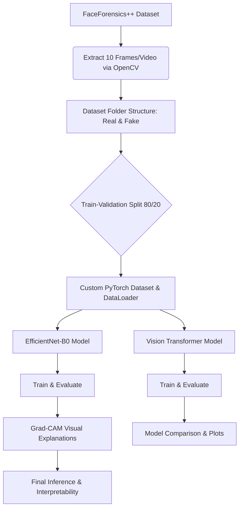

# DeepGuard: Explainable Deepfake Detection

An end-to-end deep learning pipeline for detecting deepfake videos using **Convolutional Neural Networks (EfficientNet-B0)** and **Vision Transformers (ViT)**, augmented with **Explainable AI (Grad-CAM)** to visualize and explain model decisions.

---

## Project Overview

With the rapid advancement of generative AI, deepfakes have become increasingly sophisticated, making automated detection crucial. This project implements and compares two state-of-the-art architectures for deepfake image classification:
1. **EfficientNet-B0**: A computationally efficient CNN that excels at capturing local spatial textures and facial artifacts.
2. **Vision Transformer (ViT-B/16)**: An attention-based architecture that captures global context and long-range pixel relationships across the face.

To ensure the models are trustworthy, **Grad-CAM (Gradient-weighted Class Activation Mapping)** is integrated to generate visual heatmaps, revealing exactly *which* parts of the face (e.g., eyes, mouth, nose, boundary blending) led the model to classify an image as real or fake.

---

## Pipeline Architecture

The complete system pipeline is illustrated in the diagram below:



---

## Dataset: FaceForensics++ (FF-C23)

This pipeline is built and evaluated on the benchmark **FaceForensics++ (C23 compression)** dataset:
- **Original Videos**: Pristine, unaltered human face videos.
- **Deepfake Videos**: Manipulated faces generated using computer vision deepfake pipelines.
- **Frame Extraction**: The system extracts a subset of 10 evenly spaced frames per video using `cv2.VideoCapture` to form the image dataset.
- **Preprocessing**: Input images are resized to `224x224` pixels, converted to tensors, and normalized according to ImageNet statistics.

---

## Models Implemented

### 1. CNN: EfficientNet-B0
- Uses **EfficientNet-B0** pre-trained on ImageNet.
- The classifier head is adapted for binary classification (`Real` vs. `Fake`).
- Optimizes training using the `Adam` optimizer and `CrossEntropyLoss`.

### 2. Vision Transformer: ViT-B/16
- Implements the **ViT-B/16 (patch size 16x16)** model via the `timm` library.
- Leverages self-attention mechanisms to analyze relationships between different facial patches.
- Optimizes training using `AdamW` optimizer and `CrossEntropyLoss`.

---

## Explainable AI (XAI) with Grad-CAM

To avoid a "black-box" model, we use **Grad-CAM** on the final convolutional layer of EfficientNet. Grad-CAM calculates the gradients of the score for the target class with respect to the feature map activations, producing a heatmap that is overlaid on the original image:
- Shows if the model is focusing on natural indicators (like the eyes and mouth) or deepfake artifacts (like blending boundaries around the jawline or unnatural textures on the nose).
- Provides confidence scores along with logical explanations for prediction categories.

---

## Evaluation & Results

The pipeline generates the following deliverables upon execution:
- **Classification Reports**: Precision, recall, and F1-score for both classes.
- **Confusion Matrices**: Detailed visualization of True Positives, False Positives, True Negatives, and False Negatives.
- **Model Comparison**: Matplotlib bar charts comparing validation accuracy and losses between EfficientNet-B0 and the Vision Transformer.

---

## Setup & Local Installation

### Prerequisites
- Python 3.8 or higher
- NVIDIA GPU (Highly recommended for training, though CPU is supported)

### 1. Clone the Repository
```bash
git clone <your-github-repo-url>
cd <your-repo-folder-name>
```

### 2. Create a Virtual Environment
```bash
# MacOS/Linux
python3 -m venv venv
source venv/bin/activate

# Windows
python -m venv venv
venv\Scripts\activate
```

### 3. Install Dependencies
```bash
pip install -r requirements.txt
```

### 4. Run the Pipeline
Open the Jupyter Notebook locally:
```bash
jupyter notebook deepfake.ipynb
```
*Note: Make sure to update the input database path in the second cell of the notebook to point to your local dataset path.*

---

## How to Upload this Project to GitHub

Follow these simple command-line steps to push this project to your GitHub account:

### 1. Initialize Git in the project directory
```bash
git init
```

### 2. Stage all files for commit
```bash
git add .
```
*(Our `.gitignore` will automatically prevent temporary files, datasets, and cache folders from being uploaded).*

### 3. Create your first commit
```bash
git commit -m "Initial commit: End-to-end Explainable Deepfake Detection pipeline"
```

### 4. Link your local repository to GitHub
Go to GitHub, create a new repository (keep it empty, do not add a README or .gitignore there), copy the repository URL, and run:
```bash
git branch -M main
git remote add origin <YOUR_GITHUB_REPOSITORY_URL>
```

### 5. Push the project to GitHub
```bash
git push -u origin main
```
